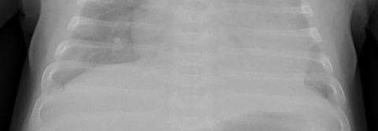

# Dataset Description

The dataset in this repository is being re-used under the license terms from [the CoronaHack Chest X-Ray Dataset on Kaggle](https://www.kaggle.com/praveengovi/coronahack-chest-xraydataset) and modified as indicated in `Dataset_Description.md`.

Original citation for the majority of the images: https://data.mendeley.com/datasets/rscbjbr9sj/2

[![CC BY 4.0][cc-by-shield]][cc-by]

This work is licensed under a [Creative Commons Attribution 4.0 International
License][cc-by].

[![CC BY 4.0][cc-by-image]][cc-by]

[cc-by]: http://creativecommons.org/licenses/by/4.0/
[cc-by-image]: https://i.creativecommons.org/l/by/4.0/88x31.png
[cc-by-shield]: https://img.shields.io/badge/License-CC%20BY%204.0-lightgrey.svg

The following modifications were made to create a dataset with a (great) majority of frontal chest X-Rays of children and adolescents:

- All adult images (based on ossification status and/or degenerative changes to the spine) were removed. Example: 

- All non frontal (i.e. not PA or AP) images were removed. Example:

- All CT-images were removed. Example:

- All non-grayscale images were removed. Example:

- All images considered of non-diagnostic quality were removed. Example:

The removed images can be found in the `Removed` folder.

The training set consists of 5163 images, the test set of 624 images.

The original metadata file was modified to represent the new dataset. Labels were encoded as follows:

| Label | Description         |
|-------|---------------------|
| 0     | Normal              |
| 1     | Bacterial Pneumonia |
| 2     | Viral Pneumonia     |

The original metadata file is `data/Chest_xray_Corona_Metadata.csv` and the new one is `data/Labels.csv`.

