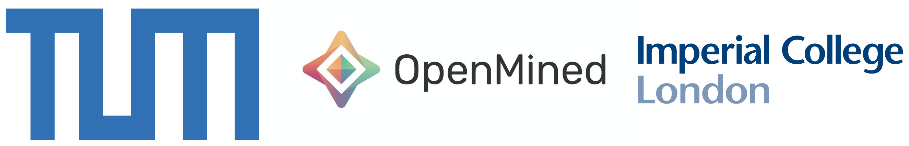

# Start Here




## About
PriMIA is a framework for end-to-end privacy preserving machine learning on medical images designed and built at the Technical University of Munich, OpenMined and Imperial College London. It enables you to do federated training of convolutional neural networks and encrypted inference from a simple command-line interface.

## Use Cases
PriMIA is designed with flexibility and accessibility in mind. It's suitable for beginners just starting out their experimentation with privacy preserving machine learning and can scale up to decentralised cloud instance training on real-life medical datasets. We incorporate current state-of-the-art privacy preservation methods from [PySyft](https://github.com/OpenMined/PySyft) and extend them with functionality tailored to medical images.

## How to get started
To train a model on a real-life medical dataset, just clone the repository, install the dependencies (documentation [here](HowTo.md)) and run:

```bash
make symbolic_server_folders

python train.py --config configs/torch/pneumonia-resnet-pretrained.ini 
--train_federated --data_dir data/server_simulation
```

PriMIA will train a ResNet18 using federated learning on PySyft VirtualWorkers and return the model weights and metrics in `model_weights`.

Then just run: 

```bash
python inference.py --model_weights <path/to/weights.pt> 
--encrypted_inference --data_dir <path/to/test_images>
```
And PriMIA will return end-to-end encrypted predictions on the test set using _Function Secret Sharing_!

We also provide many more options, such as other models, working with MNIST for weaker machines, turning on and off various privacy-enhancing technologies, hyperparameter search for the whole federation and a gamut of choices, all easy to implement via a single `.ini` file. To have a look at some more recipes, go to [this page](HowTo.md)!

## Team
PriMIA is built by a diverse team of academics, open source contributors and industry researchers.
Our core team consists of:

- Georgios Kaissis (**Project Lead**), PostDoc at TUM and ICL, OpenMined Research Scientist
- Alex Ziller (**Lead Developer**), PhD student at TUM, OpenMined Research Scientist
- Jonathan Passerat Palmbach (**Security Lead**), PostDoc at ICL, Director of Cryptography at Consensys Health
- Rickmer Braren (**Medical Lead**), Professor of Radiology at TUM
- Théo Ryffel, PhD student at INRIA, OpenMined Cryptography lead, CTO at Arkhn
- Andrew Trask, PhD student at University of Oxford, OpenMined project leader

... and many others from the Technical University of Munich, Imperial College London, INRIA, University of Oxford, OpenMined, Facebook Research, Consensys Health and Arkhn.

## Publication
This is the companion repository to our publication (xxx).

## Dataset
We used the Paediatric Pneumonia Dataset originally created by Kermany et al. For details, see [this page](Dataset_Description.md).

## Disclaimer
This software is a research product and is provided _as is_ without any guarantees of functionality, security, support or compatibility. Until appropriately validated, it must not be used in any critical workflow and we assume no liability for any user action or omission.